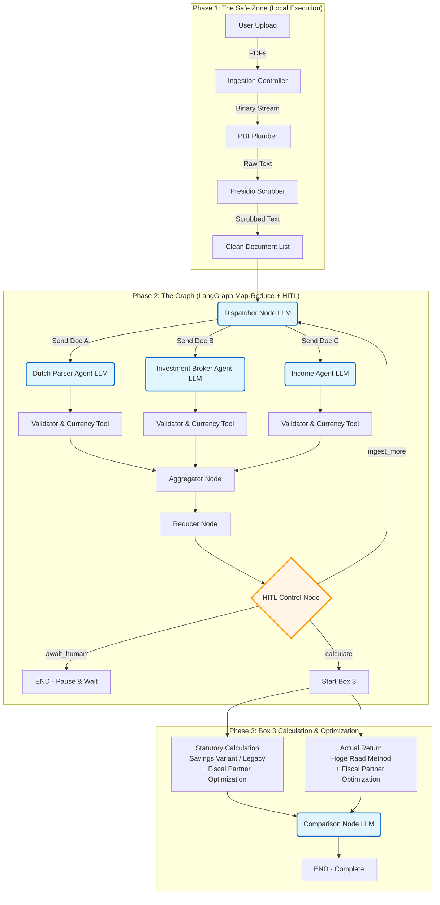

# Dutch Tax Agent 🇳🇱

> **Zero-Trust AI Tax Assistant for Dutch Personal Income Tax (Box 1 & Box 3)**

A production-grade LangGraph application that automates Dutch tax filing while adhering to strict PII governance and legal compliance requirements.

## 🎯 Key Features

- **Zero-Trust Data Policy**: PII is scrubbed before any LLM processing
- **Parallel Document Processing**: Uses LangGraph's `Send` API for concurrent parsing
- **LangGraph Checkpointing**: State persistence with 80-95% token usage reduction
- **Human-in-the-Loop (HITL)**: Iteratively add documents, review data, then calculate
- **Session Management**: Pause/resume workflows, survives restarts with SQLite persistence
- **Legal Compliance**: Handles Box 3 ambiguity by calculating both methods
- **Deterministic Math**: All calculations done with Python tools, not LLM tokens
- **Audit Trail**: Every extracted value links back to source documents

## 🏗️ Architecture



## 🚀 Quick Start

### Prerequisites

- Python 3.11+
- `uv` package manager

### Installation

```bash
# Install dependencies
uv sync

# Set up environment variables
cp .env.example .env
# Edit .env with your API keys
```

### Preparing Documents

Place your PDF tax documents in a directory (e.g., `./sample_docs`). The agent supports:

- **Dutch Bank Statements**: ING, ABN AMRO, Rabobank, etc.
- **US Brokerage Statements**: Interactive Brokers, Charles Schwab, etc.
- **Crypto Exchange Statements**: Coinbase, Binance, Kraken, etc.
- **Salary Statements**: Dutch payslips (salarisstroken)
- **Mortgage Statements**: Property-related documents

#### Broker Statement Requirements

For broker statements (US brokerage or crypto exchange), you have two options:

1. **Full Year Statement** (Recommended): Add the complete annual statement for the tax year. This statement should cover the entire tax year and show both January 1 and December 31 values.

2. **Monthly Statements** (If annual not available): If only monthly statements are available, add:
   - The **December statement from the previous tax year** (e.g., Dec 2023 for tax year 2024) - provides the January 1 value
   - The **December statement of the tax year** (e.g., Dec 2024 for tax year 2024) - provides the December 31 value

**Example for tax year 2024:**
- Option 1: `broker_statement_2024.pdf` (full year)
- Option 2: `broker_statement_dec2023.pdf` + `broker_statement_dec2024.pdf` (monthly)

### Run the Agent

#### Human-in-the-Loop (HITL) Workflow (Recommended)

The HITL workflow allows you to iteratively process documents and review data before calculation:

```bash
# Step 1: Process initial documents
uv run dutch-tax-agent ingest --input-dir ./sample_docs --year 2024
# Output: Session tax2024-abc123 created

# Step 2: Check extracted data
uv run dutch-tax-agent status --thread-id tax2024-abc123

# Step 3: Add more documents (optional)
uv run dutch-tax-agent ingest --input-dir ./more_docs --thread-id tax2024-abc123

# Step 4: Remove wrong documents (optional)
uv run dutch-tax-agent remove --thread-id tax2024-abc123 --doc-id a1b2c3d4e5f6

# Step 5: Calculate taxes
uv run dutch-tax-agent calculate --thread-id tax2024-abc123

# List all sessions
uv run dutch-tax-agent sessions
```

See [HITL Workflow Documentation](./docs/hitl_workflow.md) for complete guide.

#### One-Shot Mode (Process Everything at Once)

You can also ingest and calculate in a single workflow by chaining commands:

```bash
# Get the thread ID from ingest, then calculate immediately
THREAD_ID=$(uv run dutch-tax-agent ingest -i ./sample_docs --year 2024 | grep -oP 'tax2024-\w+')
uv run dutch-tax-agent calculate -t $THREAD_ID

# Or manually with specific thread ID
uv run dutch-tax-agent ingest -i ./sample_docs --year 2024
# Note the thread ID output (e.g., tax2024-abc123)
uv run dutch-tax-agent calculate -t tax2024-abc123
```

## 💾 Checkpointing & State Management

The agent uses LangGraph checkpointing with SQLite for persistent state management:
- **Reduce token usage by 80-95%** (documents cleared after extraction)
- **Enable human-in-the-loop workflows** (pause/resume for review)
- **Provide fault tolerance** (resume from failures)
- **Session persistence** (survives application restarts)

### Configuration

The agent defaults to SQLite checkpointing. In `.env`:

```bash
ENABLE_CHECKPOINTING=true  # Default
CHECKPOINT_BACKEND=sqlite  # Default (options: memory, sqlite, postgres)
CHECKPOINT_DB_PATH=~/.dutch_tax_agent/checkpoints.db  # Default
```

### HITL Session Management

```bash
# Process documents incrementally
uv run dutch-tax-agent ingest -i ~/docs --year 2024

# View session status
uv run dutch-tax-agent status -t tax2024-abc123

# List all sessions
uv run dutch-tax-agent sessions

# Calculate when ready
uv run dutch-tax-agent calculate -t tax2024-abc123
```

See [HITL Workflow Documentation](./docs/hitl_workflow.md) and [Checkpointing Documentation](./docs/checkpointing.md) for details.

## 📁 Project Structure

```
dutch_tax_agent/
├── src/
│   └── dutch_tax_agent/
│       ├── __init__.py
│       ├── main.py                    # Entry point
│       ├── config.py                  # Configuration
│       ├── schemas/                   # Pydantic models
│       │   ├── state.py               # Graph state definitions
│       │   ├── documents.py           # Document schemas
│       │   └── tax_entities.py        # Tax-specific models
│       ├── ingestion/                 # Phase 1: Safe Zone
│       │   ├── pdf_parser.py          # PDFPlumber logic
│       │   ├── pii_scrubber.py        # Presidio + custom recognizers
│       │   └── recognizers/           # Custom PII recognizers
│       │       ├── bsn_recognizer.py  # 11-proef implementation
│       │       ├── iban_recognizer.py
│       │       └── dob_recognizer.py
│       ├── graph/                     # LangGraph orchestration
│       │   ├── main_graph.py          # Graph construction only
│       │   ├── nodes/                 # Graph nodes (self-contained)
│       │   │   ├── dispatcher.py      # Document router
│       │   │   ├── aggregator.py      # Aggregation & Box 3 trigger
│       │   │   ├── reducer.py         # Totals & validation
│       │   │   ├── validators.py      # Data validation
│       │   │   └── box3/             # Box 3 calculation nodes
│       │   │       ├── statutory_calculation.py  # Savings Variant / Legacy method
│       │   │       ├── actual_return.py          # Hoge Raad actual return method
│       │   │       ├── optimization.py         # Fiscal partner optimization
│       │   │       ├── comparison.py             # Method comparison
│       │   │       └── start_box3.py             # Box 3 entry point
│       │   └── agents/                # LLM-based parser agents
│       │       ├── dutch_parser.py
│       │       ├── investment_broker_parser.py
│       │       └── salary_parser.py
│       ├── tools/                     # Deterministic tools
│       │   ├── currency.py            # ECB rate fetching
│       │   ├── tax_credits.py         # General Tax Credit (AHK) calculation
│       │   └── validators.py          # Type checking
│       └── data/
│           ├── box3_rates_2022_2025.json  # Box 3 rates (Savings Variant + Legacy)
│           └── pii_names.json.example     # Template for PII names (see Security section)
├── tests/
│   ├── unit/
│   ├── integration/
│   └── fixtures/
│       └── synthetic_pdfs/            # Test documents
├── .env.example
├── .gitignore
├── pyproject.toml
└── README.md
```

## 🔒 Security & Privacy

- **No PII in LLM**: BSN (including "citizen service number"), names, IBANs, addresses, phone numbers, and emails are scrubbed using Presidio before any LLM call
- **Zero-Trust Enforcement**: Documents that fail PII scrubbing are excluded from processing (not passed through with unredacted PII)
- **100% Local Processing**: All PII configuration files (names, addresses) are stored locally and **never leave your machine**. This data is never sent to LLMs, APIs, or any external services.
- **Custom 11-proef**: Validates Dutch BSN using official checksum algorithm
- **Custom Name Recognition**: Configurable name scrubbing from `pii_names.json` that handles:
  - Full names (with/without spaces, concatenated)
  - First + Last name combinations
  - Individual name parts
  - **Reversed/inverted names** (e.g., "JOHNDOE" → "EODNHOJ")
  - Case-insensitive matching
- **Custom Address Recognition**: Configurable address scrubbing from `pii_addresses.json` that handles:
  - Full addresses (street, number, postal code, city, country)
  - Separate street and number fields for flexible matching
  - Multiple city names (Dutch/English variations, e.g., "DEN HAAG" / "THE HAGUE")
  - Multiple country names (e.g., "NETHERLANDS" / "THE NETHERLANDS" / "NEDERLAND")
  - Postal codes with/without spaces (e.g., "1234AB" / "1234 AB")
  - Reversed/inverted addresses
  - Case-insensitive matching
- **Audit Trail**: Every extraction is linked to `source_doc_id` and page number
- **Deterministic Math**: Currency conversion and tax calculations use Python tools only

### Setting Up PII Name Recognition

The system uses a configuration file to recognize and scrub personal names. **This file is gitignored for security reasons and never leaves your local machine.**

1. Copy the example template:
   ```bash
   cp src/dutch_tax_agent/data/pii_names.json.example src/dutch_tax_agent/data/pii_names.json
   ```

2. Edit `pii_names.json` with your actual name(s):
   ```json
   {
     "names": [
       {
         "first": "JOHN",
         "last": "DOE",
         "middle": null,
         "full_name": "JOHN DOE"
       }
     ]
   }
   ```

3. The recognizer will automatically detect all variations including:
   - "JOHN DOE" (with space)
   - "JOHNDOE" (concatenated)
   - "EODNHOJ" (reversed)
   - "JOHN" or "DOE" (individual parts)
   - All case variations

**⚠️ Important**: 
- Never commit `pii_names.json` to git. It contains sensitive PII.
- This file is processed **only on your local machine** and is never shared with LLMs or external services.

### Setting Up PII Address Recognition

The system uses a configuration file to recognize and scrub addresses. **This file is gitignored for security reasons and never leaves your local machine.** You must add your addresses to this file for them to be scrubbed.

1. Copy the example template:
   ```bash
   cp src/dutch_tax_agent/data/pii_addresses.json.example src/dutch_tax_agent/data/pii_addresses.json
   ```

2. Edit `pii_addresses.json` with your actual address(es):
   ```json
   {
     "addresses": [
       {
         "street": "KALVERSTRAAT",
         "number": "123",
         "postal_code": "1234AB",
         "city": ["DEN HAAG", "THE HAGUE"],
         "country": ["NETHERLANDS", "THE NETHERLANDS", "NEDERLAND", "HOLLAND"],
         "full_address": "KALVERSTRAAT 123 1234 AB DEN HAAG"
       }
     ]
   }
   ```

3. The recognizer will automatically detect all variations including:
   - Street + number: "KALVERSTRAAT 123" or "KALVERSTRAAT123"
   - Postal codes: "1234AB" or "1234 AB"
   - City variations: "DEN HAAG" or "THE HAGUE"
   - Country variations: "NETHERLANDS", "THE NETHERLANDS", "NEDERLAND", "HOLLAND"
   - Full address combinations
   - Reversed/inverted addresses
   - All case variations

**⚠️ Important**: 
- Never commit `pii_addresses.json` to git. It contains sensitive PII.
- This file is processed **only on your local machine** and is never shared with LLMs or external services.
- **Addresses are only scrubbed if they are explicitly listed in this file.** Generic address detection is disabled to prevent false positives.

## 📊 Box 3 Wealth Tax Logic

The system handles the legal complexity of Dutch Box 3 (2022-2025) by implementing multiple calculation methods:

### Calculation Methods

1. **Statutory Calculation (Savings Variant)**: 
   - Standard method for 2023-2025
   - Categorizes assets into Savings, Other Assets (stocks/ETFs/crypto), and Debts
   - Applies fictitious yield rates per category
   - For 2022: Also calculates Legacy (bracket-based) method and selects the lower tax

2. **Actual Return (Hoge Raad Method)**:
   - Rebuttal scheme based on Supreme Court rulings (June 2024)
   - Includes unrealized capital gains ("paper gains")
   - Formula: Direct Returns + (Value_End - Value_Start - Deposits + Withdrawals)
   - Tax-free allowance is NOT used in this calculation (only in comparison)

3. **Fiscal Partner Optimization**:
   - Automatically allocates Box 3 assets between partners to maximize tax credits
   - Utilizes the non-working partner's General Tax Credit (AHK)
   - Critical for partners born after 1963 (no transferability)

The comparison agent presents both statutory and actual return methods with recommendations, showing potential savings.

## 🧪 Testing

```bash
# Run all tests
uv run pytest

# Run with coverage
uv run pytest --cov=dutch_tax_agent

# Test with synthetic data
uv run pytest tests/integration/test_end_to_end.py
```

## 📝 Configuration

### Environment Variables

Key environment variables:

- `OPENAI_API_KEY`: For LLM calls
- `LANGSMITH_API_KEY`: For tracing (optional)
- `LANGSMITH_ENDPOINT`: LangSmith endpoint URL (e.g., `https://eu.smith.langchain.com` for EU region)
- `ECB_API_KEY`: For currency rates (optional, falls back to cached rates)

### Fiscal Partner Configuration

By default, the system assumes a fiscal partnership (enables optimization). To disable:

```bash
# CLI flag
--no-fiscal-partner

# Or in code
agent = DutchTaxAgent(tax_year=2024, has_fiscal_partner=False)
```

The default fiscal partner configuration:
- Date of birth: 1970-01-01 (born after 1963 threshold)
- Box 1 income: €0 (non-working partner)
- Enables Box 3 asset allocation optimization

### PII Name Configuration

See the [Security & Privacy](#-security--privacy) section above for setting up `pii_names.json`.

## 🛠️ Development

```bash
# Install dev dependencies
uv add --dev pytest pytest-cov ruff mypy

# Lint
uv run ruff check .

# Type check
uv run mypy src/

# Format
uv run ruff format .
```

## 📄 License

MIT License - This is a demonstration project for educational purposes.

## ⚠️ Disclaimer

This is a **demonstration project** and should not be used for actual tax filing without proper legal review and compliance validation.

